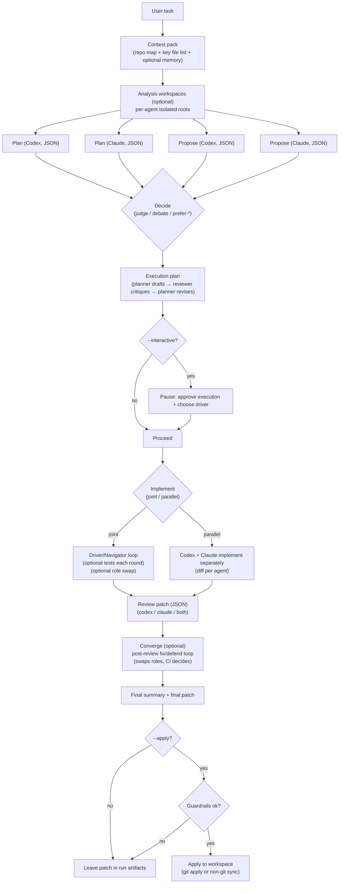

# Duet Code (Codex CLI + Claude Code CLI)

**Experimental. Slow. Incredibly expensive. Not for production.**


A local CLI that orchestrates **Codex CLI** and **Claude Code CLI** as a tiny “panel of experts”: it runs a fixed pipeline (plan → propose → decide → execution plan → implement → review → converge), captures artifacts, and can optionally apply the final patch with guardrails.

## Quick start

```bash
npm install
npm run build

# Create .orchestrator/config.json in the current directory
node dist/cli.js init --force
```

## Install (after you publish)

Global install:

```bash
npm i -g duet-code
duet --help
```

Or run without installing (npx):

```bash
npx duet-code --help
```

Edit `.orchestrator/config.json` to match your local Codex/Claude CLI commands, then verify installs/versions:

```bash
node dist/cli.js doctor
```

Run a task:

```bash
node dist/cli.js "Add a healthcheck endpoint to the API"
```

Run a task with the ASCII UI (speech bubbles) + an interactive “approve execution” gate:

```bash
node dist/cli.js "Build a tiny CLI todo app in TypeScript" --interactive --ui --apply
```

If installed globally / linked, you can also run:

```bash
# Preferred
duet "Build a tiny CLI todo app in TypeScript" --interactive --ui --apply

# Backwards-compatible alias
orchestrate "Build a tiny CLI todo app in TypeScript" --interactive --ui --apply
```

## Repo hygiene (before GitHub / npm publish)

This repo accumulates large local artifacts under `.orchestrator/` (sessions, worktrees, transcripts). They’re ignored by git, but you can remove them to keep your working directory clean:

```bash
npm run clean:repo
```

To also remove local scratch projects (like `my-todo-app/`) and large sandbox docs:

```bash
npm run clean:repo -- --all
```

## Publishing checklist (npm)

Before publishing, sanity-check what will ship:

```bash
npm test
npm pack --dry-run
```

Then publish:

```bash
# bump version (pick one)
npm version patch

# publish (use --access public if needed)
npm publish
```

## How it works (flow)



ASCII version:

```
task
  -> context pack
  -> [optional] isolate analysis workspaces
  -> plan: codex + claude (independent)
  -> propose: codex + claude (independent)
  -> decide (judge/debate/prefer-*)
  -> execution_plan (planner -> reviewer -> planner)
  -> [--interactive] approve + choose driver
  -> implement (joint driver/navigator loop OR parallel)
  -> review (structured JSON)
  -> converge (optional fix/defend loop)
  -> final.patch (+ optional --apply, guarded)
```

## UI preview (screenshot-friendly)

`--ui` renders events as left/right “speech bubbles”:
- **Codex**: left
- **Claude**: right
- **System**: centered

```
╭──────────────────────────────────────────────────────────────╮
│ CODEX · PLAN · RESPONSE                                       │
│ 2026-01-28T...Z                                               │
│                                                              │
│ {"steps":[...],"risks":[...]}                                 │
╰──────────────────────────────────────────────────────────────╯

                                        ╭──────────────────────╮
                                        │ CLAUDE · PLAN · ...  │
                                        │ 2026-01-28T...Z      │
                                        │                      │
                                        │ {"steps":[...]}      │
                                        ╰──────────────────────╯
```

## Branching exploration

```bash
node dist/cli.js "Add a healthcheck endpoint to the API" --session session-20250125_120000-abc123
node dist/cli.js "Add a healthcheck endpoint to the API" \
  --session session-20250125_120000-abc123 \
  --branch-from run-20250125_120300-def456 \
  --branch-prompt "Try a minimal change, no new dependencies"
```

## CLI options

- `--session <id>`: Reuse a session ID (required when branching).
- `--branch-from <runId>`: Parent run ID to branch from.
- `--branch-prompt <text>`: Additional prompt for the branch run.
- `--decision <mode>`: `judge` | `debate` | `prefer-codex` | `prefer-claude` | `neither`.
- `--mode <mode>`: `full` | `plan` | `implement` | `bugfix` (used to bias prompts).
- `--stream`: stream JSON transcript events to stdout (for UI playback).
- `--ui`: pretty ASCII UI output to stdout (shows prompts + responses).
- `--interactive`: pause after the execution plan to approve implementation + choose the driver (also implies `--ui`).
- `--apply`: Apply the winner patch to the current working tree.

## Config

Run `node dist/cli.js init` to generate `.orchestrator/config.json`.

Template selection:
- If your project has `./templates/config.json`, it uses that.
- Otherwise it falls back to the orchestrator’s built-in `templates/config.json` (so `init` works in empty folders).

The config supports placeholders in args:

- `{workdir}`: worktree path for the agent
- `{prompt}`: full prompt text
- `{promptFile}`: prompt file path (when `promptMode: "file"`)
- `{phase}`: plan/propose/judge/execution-plan/implement/review
- `{task}`, `{sessionId}`, `{runId}`, `{agent}`
- `{runMode}`: full/plan/implement/bugfix
- `{agentVersion}`: detected version (if available)
- `{capabilities}`: comma-separated capability list

Use `promptMode: "stdin"` (default), `"file"` (use `{promptFile}`), or `"arg"` (put `{prompt}` directly in args).
Use `versionArgs` and `minVersion` to enforce CLI versions (set `versionArgs: []` to skip), and `capabilities` to note features (for future use).
Use `decision.mode: "debate"` and `decision.debateRounds` to require consensus from both judges.
Enable `memory` to store summaries and decisions for future retrieval.
Tune `context.includeFiles` and size limits to control the shared context pack.
Set `context.isolateWorkspaces: true` to run non-implementation phases (plan/propose/decide/execution-plan) in per-agent **isolated workspaces**.
Enable `guardrails` to cap diff size / file count, block forbidden paths, and optionally forbid dependency file changes.
Enable `converge` to run a bounded post-review fix/defend loop (swaps roles; CI decides).
Use `limits.agentTimeoutMs` / `limits.judgeTimeoutMs` to prevent long-running agent calls.
Debate mode starts with independent judgments, then runs a bounded number of critique rounds to avoid infinite loops.
Use `implementation.mode: "joint"` to have a single shared implementation with driver/navigator roles.
Use `implementation.maxRounds` + `implementation.swapDriverOnFail` to cap joint collaboration loops.
Use `implementation.swapDriverEachRound` to alternate driver/navigator each round (“Codex sub-agent is Claude and vice versa”).

Example agent args (adjust to your local CLI versions):
- Codex: `["exec", "--skip-git-repo-check", "--full-auto", "--color", "never", "-C", "{workdir}"]` with `promptMode: "stdin"`
- Claude: `["-p", "--permission-mode", "acceptEdits"]` with `promptMode: "stdin"`

## Artifacts

Each run writes to:

```
.orchestrator/sessions/<sessionId>/runs/<runId>/
  context.json
  task.md
  context/
  conversation/
  plan/
  propose/
  decide/
  execution_plan/
  implement/
  review/
  converge/
  final/
```

The `context/` pack includes a repo map, key file list (excerpts written to disk), recent commits, and memory highlights shared across agents.
The `conversation/` folder stores a JSONL + Markdown transcript for UI playback.
Use `--stream` to emit the transcript events as JSONL to stdout for real-time UI.

Joint implementation mode:
- Driver edits the canonical worktree.
- Navigator proposes improvements and a patch is auto-applied (if clean).
- Tests can run after each round, and roles can swap on failure.

## Tests (cheap, no real agents)

```bash
npm test
```

This runs a tiny `node --test` suite using a local “fake agent” process (no Codex/Claude calls) to demonstrate:
- guardrails blocking unsafe applies (dependency file changes)

## Notes

- Git worktrees are created from `HEAD`. If you have uncommitted changes, commit or stash them before running.
- If this repo is not a git repo, the orchestrator falls back to copying the folder.

## Build

```bash
npm run build
```

## Tweet-sized description

Duet Code is an experimental (and insanely expensive) “panel of experts” coding CLI: Codex + Claude Code plan → debate → implement (driver/navigator swaps) → tests → converge → patch. Slow, but fascinating.
